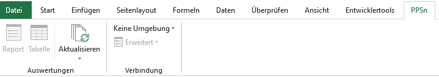
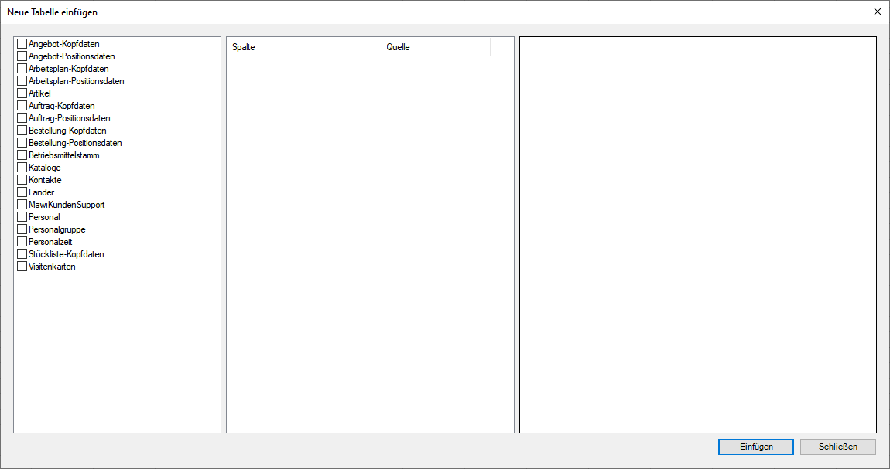
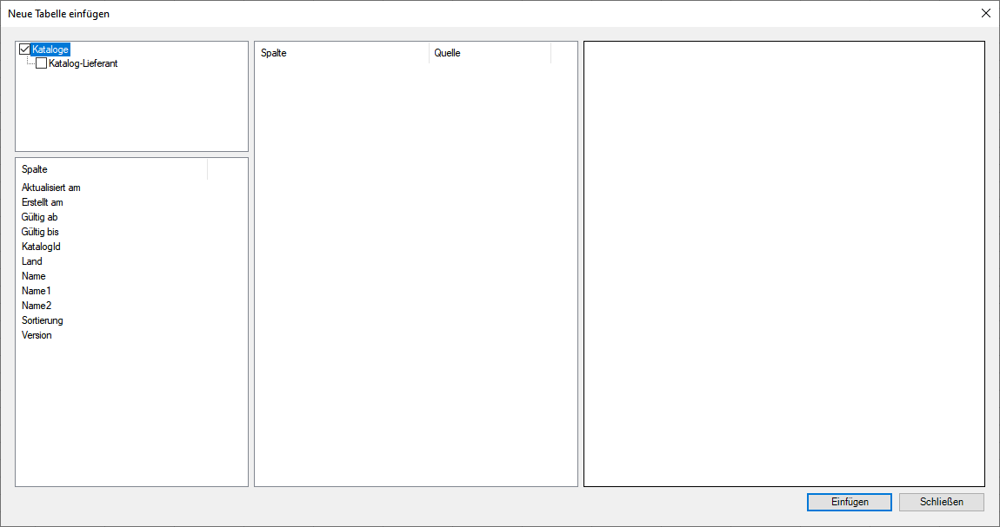
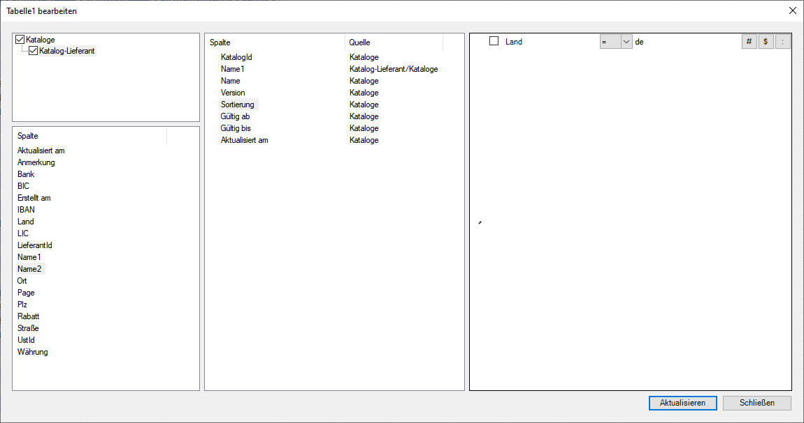

# Excel-Plugin

Lädt Smart-Tables auf Basis von Xml-Datenströmen in ein Excel Formula.

Zuerst muss eine Umgebung/Datenbankverbindung gewählt werden.

Danach können `Reporte` eingefügt/geladen oder Smart-Table definiert werden (`Tabelle`).

## Tabelle definieren

Als erstes wählt man eine Basis-Tabelle aus, 

## Spalten definieren

Spalten werden in der mittleren Liste definiert. Dies werden per Drag&Drop in die 
Rückgabe aufgenommen.

Sortierung, Name einer Spalte kann mittels des Kontextmenüs beeinflusst werden.

:::tipp
Mit F4 kann die Liste der Quellspalten auf die internen Datenbanknamen umgeschaltet werden.
:::

## Bedingungen

Die dritte Spalte beinhält die Filterbedingungen.

Neben Konstanten und anderen Felder können auch Excel-Zellen referenziert werden.

- Via Namen z.B. `$Feld`
- Oder Zelladresse z.B. `$C23` oder `$R23C3`
- Tabellen können auch angegebn werden, z.B. `$Tabelle1_C23`

:::warn
Sind die Namen der Spalten durchgestrichen, so ist diese Bedingung irrelevant für
die Rückgabe und wird beim Aktualisieren entfernt.
:::